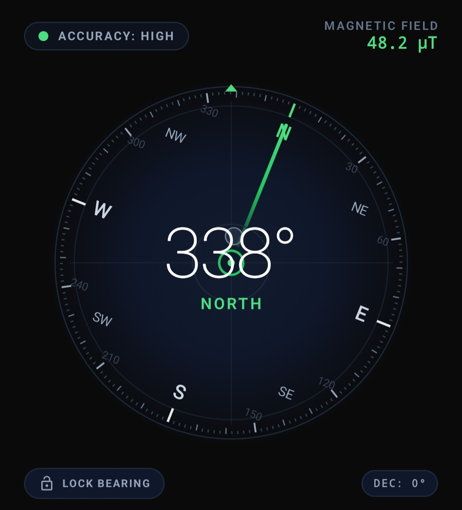
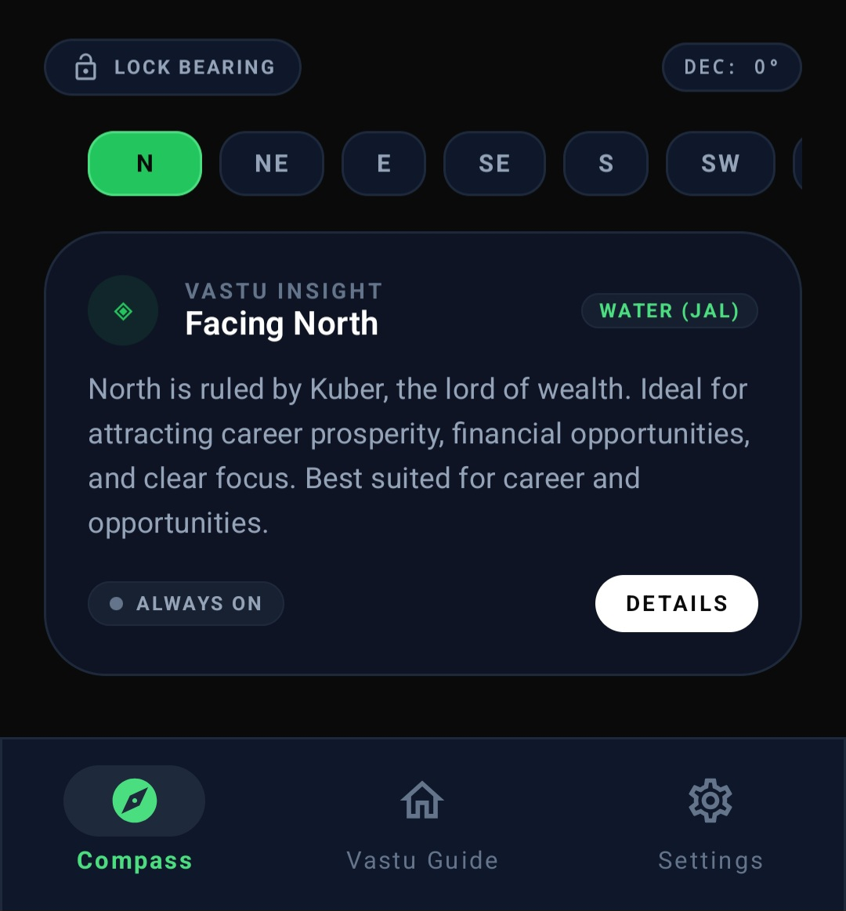
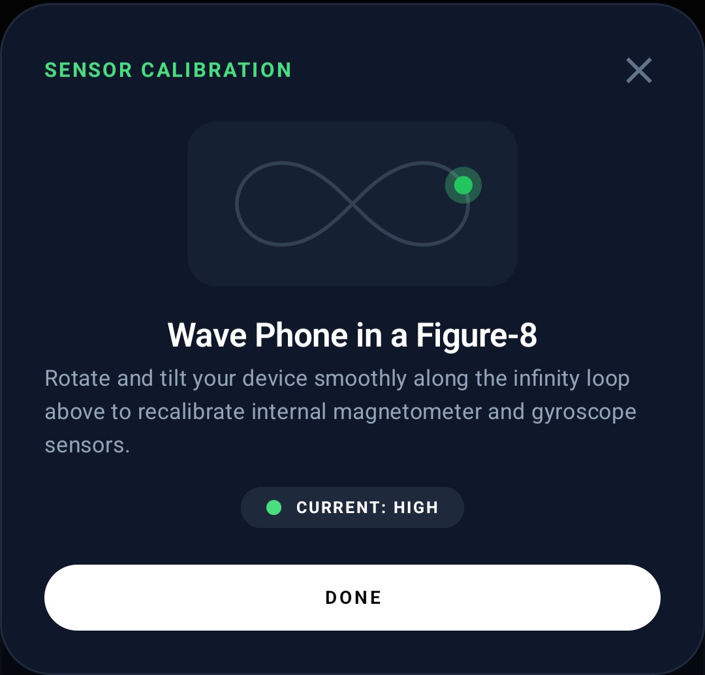
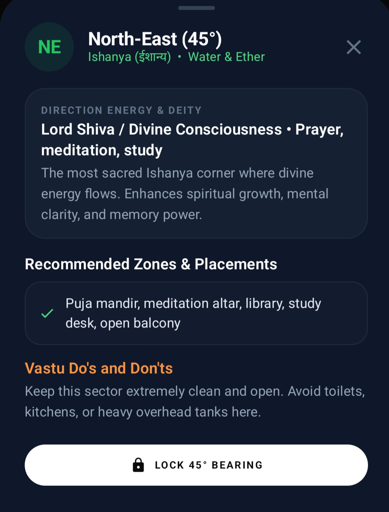

# 🧭 Compass09 (Vastu & Precision Compass)

> **A modern, 100% offline, privacy-first Android Compass featuring real-time sensor tracking, architectural Vastu Shastra direction insights, high-contrast Obsidian & Emerald aesthetics, interactive calibration diagnostics, and haptic feedback.**

---

## 🌟 Key Highlights

- 🔒 **100% Offline & Private**: Zero network permissions requested in the manifest. No third-party trackers, analytics, or background telemetry.
- 📐 **Hardware Orientation & Fusion**: Uses device `TYPE_ROTATION_VECTOR` (accelerometer, magnetometer, gyroscope) with a low-pass Slerp filter for jitter-free orientation.
- ◈ **Real-Time Vastu Shastra Insights**: Dynamic architectural zone recommendations, deity affiliations, element balancing (Panchtatva), and room placement guidelines for all 8 cardinal & ordinal directions.
- 🎨 **Sophisticated Dark UI**: Deep Obsidian AMOLED (`#0A0A0A`), sleek Slate-900 surfaces (`#0F172A`), glowing Emerald accents (`#22C55E` / `#4ADE80`), and high-contrast typography.
- 🎯 **Target Bearing Lock**: Lock on to any custom heading or degree to track deviations during hiking, navigation, or room surveying.
- 📳 **Haptic Feedback**: Gentle vibration pulse upon crossing True/Magnetic North (0° ± 2°).
- ⚖️ **Integrated Tilt & Spirit Level**: Integrated level crosshair bubble indicating pitch and roll deviations to ensure the phone is held flat.
- 🔄 **Figure-8 Sensor Calibration**: Real-time magnetic interference detection with animated Lemniscate (figure-8) guidance.

---

## 📸 Screenshots & UI Showcase

| Precision Compass Dial | Live Vastu Insight Card | Sensor Calibration |
| :---: | :---: | :---: |
|  |  |  |

| Direction Chips Selector |
| :---: |
|  |

---

## 🧭 Directional Energies & Vastu Zones

| Code | Direction | Degree | Sanskrit Name | Ruling Deity / Energy | Recommended Placements | Panchtatva Element |
| :---: | :---: | :---: | :---: | :---: | :---: | :---: |
| **N** | North | 0° / 360° | *Uttar (उत्तर)* | Lord Kuber | Home office, entrance, cash safe, living area | Water (*Jal*) |
| **NE** | North-East | 45° | *Ishanya (ईशान्य)* | Lord Shiva | Puja mandir, meditation altar, study desk | Water & Ether |
| **E** | East | 90° | *Purva (पूर्व)* | Lord Indra & Surya | Main entrance, family living area, study space | Air & Sun |
| **SE** | South-East | 135° | *Agneya (आग्नेय)* | Lord Agni | Kitchen cooktop, electrical board, inverters | Fire (*Agni*) |
| **S** | South | 180° | *Dakshin (दक्षिण)* | Lord Yama | Secondary bedrooms, storage, office cabins | Earth & Fire |
| **SW** | South-West | 225° | *Nairutya (नैऋत्य)* | Lord Nirriti | Master bedroom, heavy wardrobes, head of house | Earth (*Prithvi*) |
| **W** | West | 270° | *Pashchim (पश्चिम)* | Lord Varuna | Dining room, children's bedroom, overhead tank | Space & Water |
| **NW** | North-West | 315° | *Vayavya (वायव्य)* | Lord Vayu | Guest bedroom, pantry, garage, finished goods | Air (*Vayu*) |

---

## 🛠️ Architecture & Project Structure

```
app/
 ├── data/
 │    ├── models/CompassModels.kt           # Direction enums, SensorAccuracy, CompassData & AppSettings
 │    └── preferences/CompassPreferences.kt # DataStore for offline user settings
 ├── sensors/
 │    └── CompassSensorManager.kt           # SensorEventListener hardware interface & low-pass filtering
 ├── ui/
 │    ├── components/
 │    │    ├── CompassDial.kt               # Canvas-rendered tactical compass rose & level bubble
 │    │    ├── AccuracyBadge.kt             # Live sensor accuracy pill with colored indicator
 │    │    ├── DirectionChipsRow.kt         # Horizontal selector for 8 cardinal/ordinal points
 │    │    ├── VastuSuggestionCard.kt       # Contextual architectural insight card
 │    │    ├── CalibrationDialog.kt         # Animated Figure-8 Lemniscate recalibration modal
 │    │    └── DirectionDetailBottomSheet.kt # Full zone recommendations and avoidances
 │    ├── screens/
 │    │    ├── CompassScreen.kt             # Primary precision compass dashboard
 │    │    ├── VastuGuideScreen.kt          # Complete 8-direction architectural guide
 │    │    └── SettingsScreen.kt           # Declination slider, haptic toggles & privacy audit
 │    ├── theme/
 │    │    ├── Color.kt                     # Obsidian, Emerald, and Slate palette
 │    │    ├── Theme.kt                     # Material 3 dark color scheme
 │    │    └── Type.kt                      # Typography system
 │    └── MainScreen.kt                     # Scaffold with bottom navigation & screen awake management
 └── viewmodel/
      └── CompassViewModel.kt               # StateFlow UI state holder & haptic dispatcher
```

- **Framework**: Jetpack Compose with Material Design 3 (M3)
- **Language**: 100% Kotlin
- **Concurrency**: Kotlin Coroutines & `StateFlow`
- **Sensors**: Android `SensorManager` (`TYPE_ROTATION_VECTOR`, fallback to `TYPE_ACCELEROMETER` + `TYPE_MAGNETIC_FIELD`)
- **Testing**: Robolectric + Roborazzi JVM Native Graphics for screenshot verification

---

## ⚙️ Building & Running

### Automated GitHub Builds (Install on your Phone)
Every push, release, or manual trigger runs the automated GitHub Actions workflow (`.github/workflows/build-apk.yml`) to compile and package an installable APK:

1. Go to the **Actions** tab on GitHub.
2. Click on the latest run under **Build Android APK**.
3. Under **Artifacts**, download **`Compass09-Android-App-APK`** (`.zip`).
4. Extract and transfer `Compass09-v1.0-installable.apk` to your Android phone (or download directly from phone browser).
5. Open the APK on your phone, allow installation when prompted, and launch **Compass09**!

---

### Local Development & Testing
- Android SDK 34+
- Java 17+
- Gradle 8.x+ / Gradle Wrapper (`./gradlew`)

```bash
# Build installable Debug APK locally
./gradlew assembleDebug

# Execute unit & Robolectric tests
./gradlew testDebugUnitTest

# Record / verify Roborazzi screenshot baselines
./gradlew recordRoborazziDebug
./gradlew verifyRoborazziDebug
```

---

## 🔒 Privacy & Permissions Notice

This application is built with a strict **Zero-Data** privacy philosophy:
- **No Internet Access**: The app does not request or require network access.
- **No Location Tracking**: Works purely from internal magnetic and orientation sensors without GPS coordinates.
- **No Analytics / Ads**: Zero trackers or third-party analytical SDKs are included.
